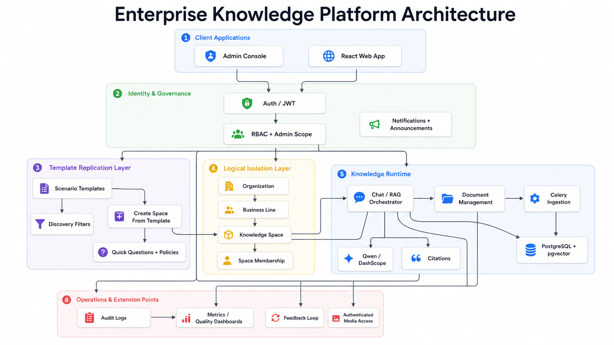

### Multi-space knowledge operations platform for professional teams

**Languages**: [English](README.md) / [中文](README_ZH.md)

---

> **One platform. Infinite knowledge spaces. Every team grows its own brain.**
>
> KnowPilot is a RAG-powered knowledge agent that turns scattered documents, methodologies, project memory, and compliance rules into a governed, reusable knowledge product — so teams ask once, reuse everywhere, and keep institutional knowledge inside the organization.

---

## The Problem We Solve

### 1. Project Continuity Issues: Knowledge Leaves with Key Staff (Professional Services)
A core manager resigns and takes all the key judgment logic and client context from an IPO project. The new team member stares at dozens of folders, unable to reconstruct why certain adjustments were made. Project experience — the organization's most valuable asset — evaporates with every departure.

### 2. The New Hire Friction: Onboarding & Coordination Gaps (General Corporate)
A new hire joins the team and struggles to resolve local setup errors; they don't know who owns the permissions for required internal systems, and expense reports are repeatedly rejected due to formatting issues. Senior team members are too busy with deliveries to help. New hires aren't underperforming — the organization's knowledge isn't paving the road for them.

### 3. Compliance and Separation Risks: Data Leakage & Inconsistency (Finance & High Compliance)
Multi-national financial units operate independently. Without secure boundaries and unified knowledge access, teams risk cross-contamination of restricted data. Moreover, when new regulations emerge, inconsistent interpretation across branches risks major compliance fines. Organizations need a system that shares core knowledge while maintaining strict project/space isolation.

### The Systemic Pain Points

| Symptom | Impact |
| --- | --- |
| Knowledge scattered across manuals, intranets, PDFs, and people's heads | High search cost, incomplete answers |
| Same question gets different answers from different people | Inconsistent professional judgment |
| Policy updates don't propagate to old documents | Teams act on stale information |
| Project experience lives in individuals, not systems | Knowledge resets on every departure |

---

## How KnowPilot Changes This

**Before KnowPilot** — hours of manual lookup, inconsistent answers, knowledge trapped in silos.

**After KnowPilot** — every team has its own AI-powered knowledge space. One question returns a source-cited answer in seconds. One platform serves unlimited spaces. Each space accumulates and evolves independently.

| What changes | Before | After |
| --- | --- | --- |
| Finding an answer | Dig through folders, ask around | Ask the agent, get a cited answer in seconds |
| Onboarding a new hire | Weeks of shadowing and guessing | Self-serve Q&A from day one |
| Reusing project experience | Locked in departed employees' heads | Searchable, governed, always available |
| Ensuring consistency | "It depends on who you ask" | Unified standard answers across the team |
| Scaling to new teams | Rebuild everything from scratch | Clone a template, upload docs, go live |

---

## Use Cases

KnowPilot is industry-agnostic. Upload different documents, create different spaces — the same engine powers every scenario. Here are representative examples across verticals:

### 🏢 Professional Services

| Scenario | Knowledge base content | Example queries |
| --- | --- | --- |
| Engagement AI | Project memos, client background, decision logs | "Why was this adjustment made?" "What was the client's rationale last year?" |
| Methodology Q&A | Methodology manuals, procedure guides | "What's the standard sampling process?" "How does TOC/TOD work?" |
| Standards assistant | Regulatory standards (IFRS / CAS / HKFRS / GAAP) | "How does IFRS 15 five-step model apply to SaaS revenue?" |
| Working paper prep | Templates, best practices, field guides | "What are the format requirements for this deliverable?" |

### 🏦 Financial Services & Compliance

| Scenario | Knowledge base content | Example queries |
| --- | --- | --- |
| Regulatory compliance | AML/KYC policies, Basel rules, local regulations | "What's the CDD requirement for high-risk clients?" |
| Risk & controls | Internal control frameworks, risk registers | "Which controls apply to the wire transfer approval process?" |
| Product knowledge | Product specs, fee schedules, terms & conditions | "What's the early termination penalty for this fixed deposit?" |

### 🏥 Healthcare & Life Sciences

| Scenario | Knowledge base content | Example queries |
| --- | --- | --- |
| Clinical guidelines | Treatment protocols, drug formularies | "What's the first-line treatment for Type 2 diabetes?" |
| Research knowledge base | Published papers, trial data, SOPs | "What adverse events were reported in Phase III for compound X?" |
| Regulatory submission | FDA/NMPA filing requirements, review checklists | "What documents are required for an IND application?" |

### 💻 Technology & Engineering

| Scenario | Knowledge base content | Example queries |
| --- | --- | --- |
| Engineering wiki | Architecture docs, API references, runbooks | "How does the payment service handle idempotency?" |
| Developer onboarding | Codebase guides, environment setup, conventions | "How do I set up the local development environment?" |
| Incident knowledge | Postmortems, escalation procedures, SLAs | "What was the root cause of the March 15 outage?" |

### 🏭 Manufacturing & Supply Chain

| Scenario | Knowledge base content | Example queries |
| --- | --- | --- |
| Quality standards | ISO procedures, SOPs, inspection checklists | "What are the acceptance criteria for incoming raw materials?" |
| Safety & EHS | Safety manuals, MSDS sheets, incident reports | "What's the lockout/tagout procedure for Line 3?" |
| Supplier management | Supplier audits, qualification records | "Which suppliers are approved for titanium alloy grade 5?" |

### 🏛️ Government & Public Sector

| Scenario | Knowledge base content | Example queries |
| --- | --- | --- |
| Policy Q&A | Laws, regulations, policy interpretations | "What are the eligibility criteria for the SME subsidy program?" |
| Citizen service | Service guides, FAQ, application procedures | "What documents do I need for a business registration?" |
| Internal operations | SOPs, procurement rules, staffing guidelines | "What's the approval workflow for purchases over 50K?" |

### 🔁 Cross-Industry Scenarios

These work in **any** organization:

| Scenario | Knowledge base content | Example queries |
| --- | --- | --- |
| **New hire onboarding** | HR guides, IT setup, policies, culture docs | "How do I configure the VPN?" "How does expense reimbursement work?" |
| **Training & certification** | Course materials, exam prep, competency frameworks | "What topics are covered in the Level 2 certification?" |
| **Legal & contract** | Contract templates, legal opinions, case references | "What's the standard NDA term for vendor agreements?" |
| **Project knowledge** | Meeting minutes, decision logs, lessons learned | "What was the key blocker in Q2 and how was it resolved?" |

---

## Core Capabilities

| Capability | Business scenario | Value produced |
| --- | --- | --- |
| **Source-backed RAG Q&A** | Standards, onboarding, project questions | Seconds-level answers with citations instead of manual search |
| **Multi-space isolation** | Org / business line / project team separation | Clear data boundaries, reduced leakage risk |
| **Access-code joining** | Pilot spaces, controlled onboarding, demos | Low-friction entry without weakening governance |
| **Role-based governance** | Owner, admin, reviewer, member, guest | Right people manage the right space with least privilege |
| **Document lifecycle** | Upload, re-index, delete, archive | Knowledge base stays current and actionable |
| **Template-driven replication** | Onboarding, audit methodology, standards, project AI | Cuts setup time for new spaces and teams |
| **Audit logging** | Sensitive operations, permission events, admin actions | Full traceability for compliance and review |
| **Session-scoped chat** | Cross-session, cross-space continued work | Preserves context without leaking across boundaries |

---

## Architecture

KnowPilot uses one shared platform core with logical isolation. It scales by adding organizations, business lines, spaces, templates, policies, and knowledge stores, not by cloning deployments for every team.

  

Click the architecture diagram to open the full-size image for zooming.

## Screenshots

### Login

### Dashboard

### Chat

---

## Replication Model

KnowPilot is designed to be replicated at the space level — not rebuilt per team.

**One deployment validated → replicate to hundreds of teams without hundreds of deployments.**

### Reuse path

1. Create a new organization or business line.
2. Create a knowledge space from a scenario template.
3. Assign roles and access codes.
4. Upload or ingest the relevant documents.
5. Start answering with the same governed RAG engine.

### Integration boundary

Teams can adopt individual modules without pulling in the entire product:

- Chat only
- Document management only
- Space governance only
- Audit and logging only
- Template-based onboarding only

---

## Why KnowPilot — Not Another Chatbot

| Dimension | Generic chatbot | KnowPilot |
| --- | --- | --- |
| Data boundary | None — all users see everything | Space-level isolation with RBAC |
| Answer traceability | No sources | Every answer cites its source document |
| Scaling model | One bot, one purpose | One platform, unlimited governed spaces |
| Compliance | No audit trail | Full operation logging with permission tracking |
| Knowledge lifecycle | Static upload | Upload, re-index, archive, delete |
| Replication cost | Build from scratch each time | Clone template → upload docs → go live |

---

## Tech Stack

| Layer | Technology |
| --- | --- |
| Backend | Django 5.0 + DRF + Celery + Redis |
| Frontend | React 18 + TypeScript + Vite + Ant Design 5 + Zustand |
| LLM | Qwen via DashScope API (OpenAI-compatible) |
| Embeddings | Qwen text-embedding-v4 (1024-dim) |
| Vector DB | pgvector (PostgreSQL 16) |
| RAG | LangChain + Docling |
| Infra | Docker Compose one-click deployment |

---

## License

This project is licensed under the [CC BY-NC-SA 4.0](LICENSE) (Creative Commons Attribution-NonCommercial-ShareAlike 4.0 International) License.

### 🚫 Commercial Use Clarification & Prohibitions:

To avoid ambiguity, the following activities are explicitly defined as **Commercial Use** and are **strictly prohibited** under this license:
- **No Enterprise Internal Deployment**: Any for-profit entity (e.g., accounting/audit firms, consulting firms, tech companies) is **strictly prohibited** from deploying or using this project on internal networks, servers, or cloud infrastructure for staff training, operations, project delivery, or as an internal productivity tool.
- **No Integration in Commercial Products/Services**: You may not integrate any part of this codebase into paid SaaS, software platforms, proprietary commercial solutions, or any service offered for a fee.
- **No Indirect Commercial Benefit**: You may not use this project as a delivery tool for commercial consulting, paid technical support, or outsourcing services.

**Any violation of these terms will result in the immediate and automatic termination of your license. The project owners reserve the right to seek all available legal remedies, demand an immediate cessation of use, and claim damages.**

For commercial licensing, enterprise versions, or custom authorization, please contact the project maintainers.
