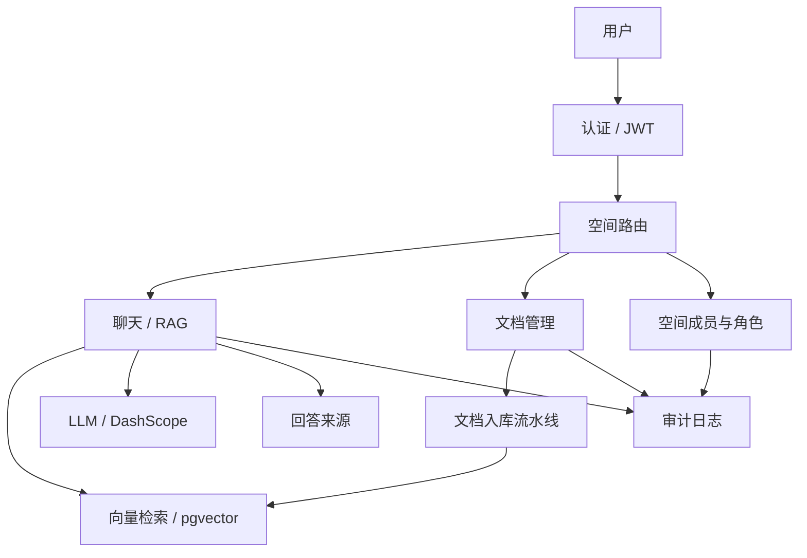

### 面向专业服务团队的多空间知识运营平台

**语言**：[English](README.md) / [中文](README_ZH.md)

---

> **一套平台，无限空间，让组织的每一个作战单元都长出自己的大脑。**
>
> KnowPilot 是一个 RAG 驱动的知识 Agent，将散落在文档、方法论、项目记忆与合规规则中的知识，构建成可治理、可复用的组织级知识产品——一次提问、多次复用，把组织知识留在组织内部。

---

## 我们解决的问题

### 1. 项目经验断裂：知识跟着人走了（专业服务场景）
核心 Manager 离职，带走了某 IPO 项目的所有关键判断逻辑和客户沟通语境。新承接的同事对着几十个文件夹的底稿，不知道当初为什么做了这些调整，上下文完全断裂。项目经验本应是组织最宝贵的资产，却永远沉淀在离职员工的脑子里，一离职就归零。

### 2. 新人“社死”现场：跨部门协同与入职指引断层（通用办公场景）
新员工入职第一周，配置开发环境报错无处查找；申请系统权限不知该联系哪个组的 Owner；打车报销因描述格式填错被打回数次。想问老员工，大家都在开会冲刺或忙于业务交付，根本无暇他顾。新人不是不努力，是组织的隐性知识没有为他铺路，每一次挫败都在消耗归属感和效率成本。

### 3. 合规与多线风险：数据泄露与标准不一（金融与高合规场景）
跨国金融业务线庞杂，各地区各团队各自为战。因缺乏有效的权限隔离和统一知识检索库，不仅存在机密数据误交叉泄露的重大隐患，在面对最新监管法规变更时，不同分支机构做出的合规判断口径不一，导致面临合规处罚风险。组织需要既能统一共享基础知识，又能按项目/业务线强隔离的知识安全运行系统。

### 核心共性痛点

| 症状 | 影响 |
| --- | --- |
| 知识散落在手册、内网、PDF 与个人经验中 | 查找成本高，查不全 |
| 同一问题不同人给出不同解读 | 专业判断标准不一致 |
| 制度更新后旧文档不同步 | 团队依过期信息做判断 |
| 项目经验沉淀在个人脑中 | 人员流动后知识流失 |

---

## KnowPilot 如何改变这一切

**使用前** — 耗时翻文件、答案不统一、知识困在个人脑中。

**使用后** — 每个项目组都拥有了自己的专属 AI 知识库。一句提问，秒级返回带来源引用的答案。同一平台，千万个独立知识空间，各自沉淀、各自进化。

| 维度 | 使用前 | 使用后 |
| --- | --- | --- |
| 找到一个答案 | 翻文件夹、问同事 | 问 Agent，秒级获得带引用的答案 |
| 新人入职 | 跟师数周，靠猜 | 第一天起自助问答 |
| 复用项目经验 | 锁在离职员工脑中 | 可检索、可治理、始终可用 |
| 保持判断一致 | "问谁就是谁的答案" | 全员统一标准答案 |
| 扩展到新团队 | 一切从零搭建 | 克隆模板 → 上传文档 → 即刻上线 |

---

## 应用场景

KnowPilot 不限行业。上传不同文档、创建不同空间——同一引擎驱动所有场景。以下是跨行业的典型应用：

### 🏢 专业服务

| 场景 | 知识库内容 | 典型问答 |
| --- | --- | --- |
| 项目 AI 助手 | 项目备忘录、客户背景、决策日志 | "这个调整为什么这么做？""客户去年的意见是什么？" |
| 方法论问答 | 方法论手册、操作指南 | "标准抽样流程是什么？""TOC/TOD 怎么做？" |
| 准则助手 | 监管准则（IFRS / CAS / HKFRS / GAAP） | "IFRS 15 五步法如何适用于 SaaS 收入确认？" |
| 交付物模板 | 模板、最佳实践、字段指引 | "这份交付物的格式要求是什么？" |

### 🏦 金融与合规

| 场景 | 知识库内容 | 典型问答 |
| --- | --- | --- |
| 监管合规 | 反洗钱/KYC 政策、巴塞尔规则、本地法规 | "高风险客户的尽调要求是什么？" |
| 风控与内控 | 内控框架、风险登记册 | "电汇审批流程适用哪些控制措施？" |
| 产品知识库 | 产品说明、费率表、条款细则 | "这款定期存款的提前终止罚金是多少？" |

### 🏥 医疗与生命科学

| 场景 | 知识库内容 | 典型问答 |
| --- | --- | --- |
| 临床指南 | 诊疗方案、药物目录 | "2 型糖尿病的一线治疗方案是什么？" |
| 科研知识库 | 已发表论文、试验数据、SOP | "化合物 X 在 III 期试验中报告了哪些不良事件？" |
| 注册申报 | FDA/NMPA 申报要求、审评清单 | "IND 申请需要提交哪些文件？" |

### 💻 科技与工程

| 场景 | 知识库内容 | 典型问答 |
| --- | --- | --- |
| 工程 Wiki | 架构文档、API 参考、运维手册 | "支付服务如何处理幂等性？" |
| 开发者入职 | 代码库指南、环境搭建、编码规范 | "如何搭建本地开发环境？" |
| 故障知识库 | 事后复盘、升级流程、SLA | "3 月 15 日宕机的根因是什么？" |

### 🏭 制造与供应链

| 场景 | 知识库内容 | 典型问答 |
| --- | --- | --- |
| 质量标准 | ISO 程序文件、SOP、检验清单 | "原材料进货验收标准是什么？" |
| 安全与 EHS | 安全手册、MSDS、事故报告 | "3 号产线的上锁挂牌流程是什么？" |
| 供应商管理 | 供应商审核记录、资质档案 | "哪些供应商通过了 5 级钛合金认证？" |

### 🏛️ 政府与公共服务

| 场景 | 知识库内容 | 典型问答 |
| --- | --- | --- |
| 政策问答 | 法律法规、政策解读 | "中小企业补贴计划的申请条件是什么？" |
| 市民服务 | 办事指南、常见问题、申请流程 | "营业执照注册需要哪些材料？" |
| 内部运营 | SOP、采购规则、人事指引 | "5 万元以上采购的审批流程是什么？" |

### 🔁 跨行业通用场景

以下场景适用于**任何组织**：

| 场景 | 知识库内容 | 典型问答 |
| --- | --- | --- |
| **新人入职** | HR 指南、IT 配置、制度手册、企业文化 | "VPN 怎么配置？""报销流程怎么走？" |
| **培训与认证** | 课程资料、考试题库、能力模型 | "二级认证考试涵盖哪些内容？" |
| **法务与合同** | 合同模板、法律意见书、案例参考 | "供应商协议的标准 NDA 期限是多久？" |
| **项目知识沉淀** | 会议纪要、决策日志、经验教训 | "Q2 的核心阻塞点是什么？是如何解决的？" |

---

## 核心能力

| 能力 | 场景 | 价值产出 |
| --- | --- | --- |
| **带来源的 RAG 问答** | 审计准则、入职培训、项目咨询 | 用可追溯答案代替手工查找 |
| **多空间隔离** | 组织、业务线、项目团队 | 明确边界，降低数据误触与泄露风险 |
| **访问码接入** | 新空间试运行、演示、受控接入 | 低摩擦加入，同时保留治理边界 |
| **角色治理** | Owner / 管理员 / 审核者 / 成员 / 访客 | 让"对的人"管理"对的空间" |
| **文档生命周期** | 上传、重建索引、删除、归档 | 让知识库持续可用、可追溯 |
| **模板化复制** | 入职、标准问答、审计、项目 | 新空间上线时间更短 |
| **审计日志** | 敏感操作、权限失败、管理员行为 | 支撑合规与复盘 |
| **会话上下文隔离** | 跨会话、跨空间持续咨询 | 复用上下文但不跨界泄露 |

---

## 架构与扩展性

KnowPilot 采用"共享核心 + 空间逻辑隔离"架构，优先按空间增长，而非按团队复制系统。

## 产品截图

### 登录页

### 主页

### 对话页

---

## 复用与落地

KnowPilot 以空间为单位复制，不以项目重建为单位重复搭建。

**验证一个团队的价值 → 复制到一百个团队，不需要一百倍的投入。**

### 落地路径

1. 创建组织或业务线。
2. 基于场景模板创建知识空间。
3. 配置角色与访问码。
4. 上传或接入知识文档。
5. 使用同一套治理 RAG 引擎开始服务。

### 集成边界

团队可按需启用单一模块，而无需引入整套产品：

- 仅启用聊天能力
- 仅启用文档能力
- 仅启用空间治理
- 仅启用审计日志
- 仅启用模板化入职

---

## 为什么是 KnowPilot，而不是"又一个聊天机器人"

| 维度 | 通用聊天机器人 | KnowPilot |
| --- | --- | --- |
| 数据边界 | 无——所有用户看到所有数据 | 空间级隔离 + RBAC 权限 |
| 答案可追溯 | 无来源 | 每条回答引用来源文档 |
| 扩展模型 | 一个 bot 做一件事 | 一个平台，无限个治理空间 |
| 合规能力 | 无审计链路 | 全操作日志 + 权限追踪 |
| 知识生命周期 | 静态上传 | 上传、重建索引、归档、删除 |
| 复制成本 | 每次从零搭建 | 克隆模板 → 上传文档 → 即刻上线 |

---

## 技术栈

| 层 | 技术 |
| --- | --- |
| 后端 | Django 5.0 + DRF + Celery + Redis |
| 前端 | React 18 + TypeScript + Vite + Ant Design 5 + Zustand |
| 大模型 | 通义千问 via DashScope API（OpenAI 兼容协议） |
| 向量嵌入 | Qwen text-embedding-v4（1024 维） |
| 向量数据库 | pgvector（PostgreSQL 16） |
| RAG 框架 | LangChain + Docling |
| 基础设施 | Docker Compose 一键部署 |

---

## 许可

本项目采用 [CC BY-NC-SA 4.0](LICENSE)（署名-非商业性使用-相同方式共享）许可协议。

### 🚫 商业使用界定及严禁行为：

为了避免协议条款的歧义，特此明确：**以下行为均被视为“商业使用”，属于严禁范围**：
- **禁止企业内部部署与提效**：盈利性机构（如审计/会计事务所、咨询公司、科技企业等）**不得**将本项目部署于其内部网络、服务器或云端，用于员工日常提效、入职培训、项目交付或作为内部办公工具。
- **禁止集成至收费产品/服务**：不得将本项目的全部或部分代码集成到任何收费的 SaaS、软件平台、商业化解决方案或向第三方收费的服务中。
- **禁止间接获利**：不得将本项目用作商业咨询、有偿技术支持或外包服务的交付工具。

**任何违反上述条款的行为都将导致授权自动失效。项目版权所有者保留依法追究侵权责任、要求立即停止侵权行为并进行经济索赔的权利。**

如有商业化合作、企业版采购或特定授权需求，请联系项目维护者获取商业授权许可。
