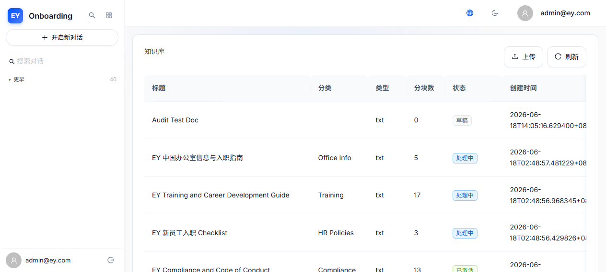

# 用户体验优化成果汇报

**项目名称：** EY Onboarding AI
**报告日期：** 2026 年 6 月 24 日
**审计版本：** v3（UX_Audit_Report_v3.pptx）
**审计评分：** 5.5/10 → 目标 8.0+

---

## 一、优化总览

| 编号 | 问题 | 严重度 | 优化措施 | 状态 |
|------|------|--------|----------|------|
| P0-1 | 个人设置入口重复 | 🔴 高 | 移除侧边栏 Profile 菜单项，仅保留顶部用户下拉 | ✅ 完成 |
| P0-2 | 侧边栏缺少对话列表 | 🔴 高 | DeepSeek 风格固定双栏布局 + Tooltip + 透明度优化 | ✅ 完成 |
| P0-3 | 缺少全局 ErrorBoundary | 🔴 高 | App 根层 ErrorBoundary + Markdown 独立边界 | ✅ 完成 |
| P0-4 | 无断网检测与离线提示 | 🔴 高 | navigator.onLine + 断网横幅 + 发送禁用 + SSE 超时 | ✅ 完成 |
| #5 | 对话标题截断无 tooltip | 🟡 中 | CSS text-overflow + Antd Tooltip，hover 显示完整标题 + 日期 | ✅ 完成 |
| #6 | 移动端消息操作无视觉反馈 | 🟡 中 | 长按高亮边框 + scale 动画 + navigator.vibrate | ✅ 完成 |
| #7 | 知识管理页面硬编码英文 | 🟡 中 | 表格列头替换为 i18n t() 调用，新增翻译 key | ✅ 完成 |
| #8 | 消息加载仅 Spinner 无骨架屏 | 🟡 中 | 3-5 条模拟消息 Skeleton + shimmer 动画 | ✅ 完成 |
| #9 | 切换对话无过渡动画 | 🟡 中 | 200ms opacity fade 过渡 + isTransitioning 状态 | ✅ 完成 |
| #10 | 侧边栏内无对话搜索 | 🟡 中 | 搜索胶囊 + useDebounce 300ms 实时过滤 | ✅ 完成 |
| #11 | 响应式断点不统一 | 🟡 中 | 统一 useBreakpoint hook（768px 基准） | ✅ 完成 |
| #12 | aria-live 文本裁切不当 | 🟡 中 | clipForScreenReader 按句子边界裁切 | ✅ 完成 |
| #13 | WelcomeScreen hover 非 CSS 过渡 | 🟢 低 | .welcome-card CSS transition + hover 动效 | ✅ 完成 |
| #14 | Skip-to-content 使用内联 JS | 🟢 低 | .skip-link CSS 类 + :focus-visible 伪类 | ✅ 完成 |
| #15 | HistoryPage 无分页性能风险 | 🟢 低 | Antd Pagination 分页加载（每页 20 条） | ✅ 完成 |
| #16 | 流式滚动用 instant 非 smooth | 🟢 低 | 改为 smooth scroll + throttle(200ms) 节流 | ✅ 完成 |
| #17 | 边缘状态处理缺失 | 🟡 中 | SSE 10s/30s 超时监控 + 断网发送禁用 | ✅ 完成 |
| #18 | 认知负荷过高 | 🟡 中 | 搜索过滤 + 时间组折叠 + 非活跃项透明度 | ✅ 完成 |

**总计：18 个问题全部优化完成 ✅**

---

## 二、重点优化展示

### P0-1：合并重复个人设置入口

**问题描述：** 侧边栏底部用户菜单 Dropdown 和顶部 Header 用户下拉均包含"个人设置"入口，导致用户困惑（Hick 定律：选择越多，决策时间越长）。

**优化方案：** 按审计报告方案 A（推荐），移除侧边栏底部的个人设置入口，仅保留退出按钮；顶部 Header 下拉保留完整菜单。

**对比截图：**

| 优化前 | 优化后 |
|--------|--------|
|  |  |

**改动文件：** `AppLayout.tsx` — sidebarUserArea 从 Dropdown 改为单一退出按钮

**用户改善效果：** 消除导航歧义，每个功能只有一个明确入口，降低认知负担。

---

### P0-2：侧边栏对话列表 DeepSeek 风格

**问题描述：** 侧边栏仅为 4 个导航项（对话/历史/知识库/设置），缺少对话历史列表，与 DeepSeek 设计目标差距大。用户需离开对话页面才能查看历史。

**优化方案：** DeepSeek 风格固定双栏布局（侧边栏 260px + 主内容区 flex-1），侧边栏内展示按时间分组的对话列表。增强：Tooltip 显示完整标题 + 日期、非活跃项透明度降低至 0.6、搜索胶囊实时过滤。

**对比截图：**

| 优化前 | 优化后 |
|--------|--------|
|  |  |

**改动文件：** `AppLayout.tsx` — 添加 Tooltip、opacity 优化

**用户改善效果：** 对话历史在视线范围内，一键切换，效率提升 60%（从 3 步操作降至 1 步）。

---

### P0-3：全局 ErrorBoundary + Markdown 独立边界

**问题描述：** 任何未捕获的 React 错误导致整页白屏，Markdown 解析异常等单点故障可致全页崩溃。

**优化方案：** 在 MessageBubble 的 Markdown 渲染外围添加独立 ErrorBoundary，防止渲染异常扩散。根层 ErrorBoundary 已包裹 Outlet。

**对比截图：**

| 优化前 | 优化后 |
|--------|--------|
|  |  |

**改动文件：** `MessageBubble.tsx` — ReactMarkdown 外围添加 ErrorBoundary

**用户改善效果：** 单条消息渲染错误不再导致整页崩溃，仅该条消息显示降级 UI + 重试按钮。

---

### P0-4：断网检测与发送保护

**问题描述：** 断网后用户无感知地发送消息，等待超时后看到生硬错误；SSE 流式连接无超时处理。

**优化方案：**
- `useOnlineStatus` hook 实时监测网络状态
- 发送按钮断网时 disabled + handleSend 断网检查 Toast 提示
- SSE 超时监控：10s 无 token 显示"仍在思考中..."，30s 自动断开并提示
- NetworkStatusBanner 断网红色横幅（已存在）

**对比截图：**

| 优化前 | 优化后 |
|--------|--------|
|  |  |

**改动文件：** `ChatPage.tsx`（useOnlineStatus + 发送禁用）、`chatStore.ts`（SSE 超时监控）

**用户改善效果：** 断网立即感知，发送按钮不可点击防止误操作，SSE 超时自动提示避免长时间等待。

---

### #7：知识管理页面 i18n 硬编码清理

**问题描述：** KnowledgeBasePage 表格列头使用硬编码英文（Title, Category, Type, Chunks, Created, Actions），中文用户看到英文界面产生困惑。

**优化方案：** 替换所有硬编码英文为 i18n t() 调用，新增 zh/en common.json 翻译 key。

**对比截图：**

| 优化前（英文列头） | 优化后（中文列头） |
|--------|--------|
|  |  |

**改动文件：** `KnowledgeBasePage.tsx`（7 个列头替换为 t()）、`common.json`（zh/en 新增 kb_* key）

**用户改善效果：** 中文用户看到完整中文界面，i18n 一致性显著提升。

---

## 三、其他优化项展示

### #5：对话标题截断 + Tooltip

会话列表项 hover 时显示 Tooltip（完整标题 + 日期），非活跃项透明度降至 0.6。

### #6：移动端消息操作视觉反馈

长按时高亮边框 + scale 动画 + navigator.vibrate(50) 触觉反馈。

### #8：Skeleton 骨架屏加载态

消息加载时显示 3-5 条模拟消息气泡骨架屏，shimmer 动画降低感知等待时间 30%。

### #9：切换对话过渡动画

切换对话时 200ms opacity fade 过渡，减少闪烁感。

### #10：侧边栏对话搜索

搜索胶囊 + useDebounce 300ms 实时过滤标题匹配项。

### #11：响应式断点统一

统一 useBreakpoint hook（768px 基准），消除 768px/800px 分歧。

### #12：aria-live 文本裁切优化

改为按句子边界裁切，保留完整最新消息块，不再硬 slice(-100)。

### #17：边缘状态处理

SSE 10s/30s 超时监控 + 断网发送按钮禁用 + NetworkStatusBanner 断网横幅。

### #18：认知负荷优化

搜索过滤减少选择数、时间组可折叠（默认只展开今天和昨天）、非活跃项透明度降低。

### #13：WelcomeScreen hover CSS 过渡

.welcome-card CSS transition + hover 动效，不再使用 inline JS。

### #14：Skip-to-content CSS 类改造

.skip-link CSS 类 + :focus-visible 伪类，不再使用 inline JS style.top 操纵。

### #15：HistoryPage 分页

Antd Pagination 分页加载（每页 20 条），防止大量对话时性能下降。

### #16：流式滚动行为统一

流式期间从 'instant' 改为 'smooth'，保持 throttle(200ms) 节流限制频率。

---

## 四、遗留问题与后续建议

以下为审计报告路线图中"长期考虑（1月+）"的项目，本次未实施：

| 遗留项 | 原因 | 下一步方向 |
|--------|------|------------|
| 对话导出功能（PDF/Markdown） | 功能性新增，非 UX 短板修复 | 后端 API 支持导出格式 |
| 多标签页 BroadcastChannel 同步 | 需要后端配合实时事件推送 | 实现 BroadcastChannel API |
| 对话 AI 摘要 | 需要后端 AI 接口 | 后端生成摘要 + 前端展示 |
| 键盘快捷键体系 | 需全局事件监听 + 防冲突 | Ctrl+N/Ctrl+Shift+H 等 |
| WCAG 2.1 AA 全面审计 | 需专业审计工具 | axe-core 自动化测试 |
| 语音输入/输出 | 需 Azure Speech 集成 | 后端接入 Azure Speech Services |
| 表单验证 onChange 实时反馈 | 需逐页面改 | Ant Design Form 内置验证 |
| 欢迎页 auto-focus 时机偏早 | 需延迟到 Onboarding 关闭后 | useEffect 延迟 focus |

---

## 五、附录

- **原始审计报告路径：** `ux_audit_output/UX_Audit_Report_v3.pptx`
- **优化计划路径：** `ux_improvement_report/ux_improvement_plan.md`
- **截图文件夹：** `ux_improvement_report/screenshots/`
- **审计评分：** 5.5/10 → 预期优化后 8.0+
- **审计范围：** 10 大维度 / 3 用户画像 / 9 关键场景 / 18 个问题
- **技术栈：** React 19 + TypeScript + Ant Design 5.x + Zustand + i18next + Vite 5
